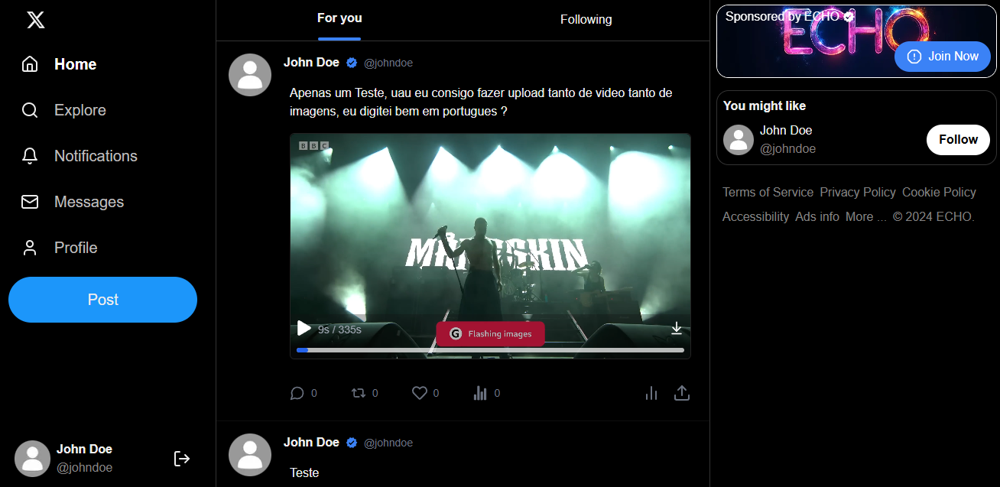

# Twitter/X Clone

This project is a study project only, I dedicated my time to improve my skills in NextJS and now I am doing a project to test them.


## Prerequisites

Before you begin, ensure you have the following tools installed:

- [Node.js](https://nodejs.org/) (v12 or higher)
- [MySQL](https://www.mysql.com/) (or another database compatible with Prisma)

## Steps to Start the Project

### 1. Clone the Repository

Clone this repository to your local machine:

```bash
git clone <repository-url>
cd <repository-name>
```

### 2. Install Prisma and Dependencies

```bash
npm install
```

### 3. Set Up the Database

Before initializing the project, you need to have a SQL database set up.

- Ensure your database is running.
- Create a database named default or modify the DATABASE_URL variable in the .env file to point to your database.

### 4. Configure the .env File

Create a .env file in the root of the project and add the following environment variables:

```bash
DATABASE_URL="mysql://root@127.0.0.1:3306/default"
SECRET="UltraSecretToken"
NEXTAUTH_URL="http://localhost:3000"
```

### 5. Run Prisma Migrations

Run the Prisma migrations to create the tables in your database:

```bash
npx prisma migrate dev
```

### 6. Initialize the Upload Server

The upload server is located in the upload-server folder. To initialize it, navigate to that folder and run:

```bash
cd upload-server
node server.js
```

### 7. Start the Main Server

After initializing the upload server, go back to the root of the project and start the main server:

```bash
npm run dev
```

### 8. Access the Application

Now you can access your application at http://localhost:3000.

# Contributors

<table>
  <tr>
    <td align="center">
      <a href="#">
        <br>
        <sub>
          <b>Banana</b>
        </sub>
      </a>
    </td>
    <td align="center">
      <a href="#">
        <br>
        <sub>
          <b>Tysaiw</b>
        </sub>
      </a>
    </td> 
    <td align="center">
      <a href="#">
        <br>
        <sub>
          <b>Isabelly</b>
        </sub>
      </a>
    </td> 
  </tr>
</table>

# Example Image




soon.